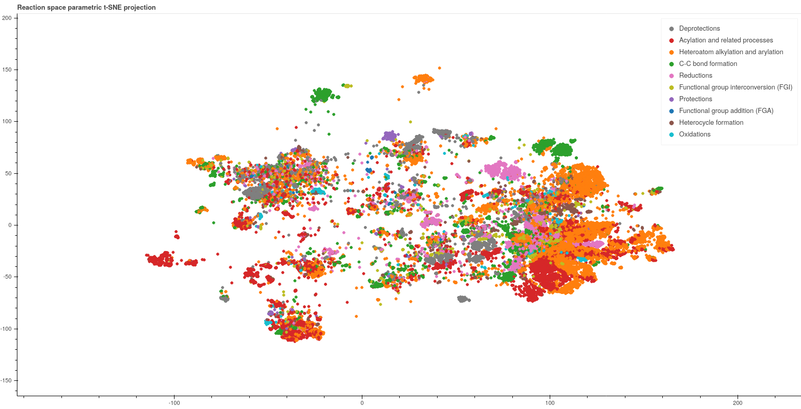

# Exploring Chemical Reaction Space With Reaction Difference Fingerprints and Parametric t-SNE
__Exploring Chemical Reaction Space With Reaction Difference Fingerprints and Parametric t-SNE__  
_Mikhail G. Andronov,Maxim V. Fedorov,and Sergey Sosnin_

This is the repositary accompanying the paper. It contains a pytorch implementation of the parametric t-SNE algorithm and the pretrained models to visualize chemical reaction space.


## Usage
Before using the code, create a new conda environment and install requred packages:
```
conda create -n <environment name> anaconda python=3.7
conda activate <environment name>
conda install -c conda-forge rdkit
conda install pytorch lightgbm
```

### Training of new models
Use the script `train.py` to train a new model. This requires a train dataset in the form of a file with reaction SMILES
and a config file. Rename the file `example.config.yaml` as `config.yaml` and set the instructions and parameters in it.
The config file contains the following instructions and hyperparameters:
* "device": "cpu" or "cuda" - device to train a model on
* "seed": random seed for pytorch
* "save_model": a flag indicating whather to save the model or not
* "problem_settings":
    * "filename": path to the train dataset
    * "fp_method": "structural" or "difference" - what type of reaction fingerprints to use
    * "n_bits": the length of the reaction fingerprint
    * "fp_type": "MorganFP", "AtomPairFP" or "TopologicalTorsion" - three options for the type of fingerprints
    * "include_agents": whether to include agents in a reaction fingerprint or not
    * "agent_weight": agent weight in difference fingerprints if agents are included
    * "non_agent_weight": non-agent weight in difference fingerprints
    * "bit_ratio_agent": the ratio of agent bits in structural fingerprints
* "optimization":
    * "lr": learning rate for the Adam optimizer
* "training": section for training hyperparameters, which is used in `model.fit_model` function    

### Exploration of the results
The script `visual_evaluation/visualize_projection.py` can be used to assess the visualization performance of a trained 
model.  

**Basic usage**  
Run the following commands in terminal:
1. `export PYTHONPATH=<directory of the project>`
2. `python3 rendering_server.py` 
3. `python3 visual_evaluation/render_reactions.py -d <path to validation dataset> -m <path to model>`
Explore the map of reaction space in a Bokeh application.
